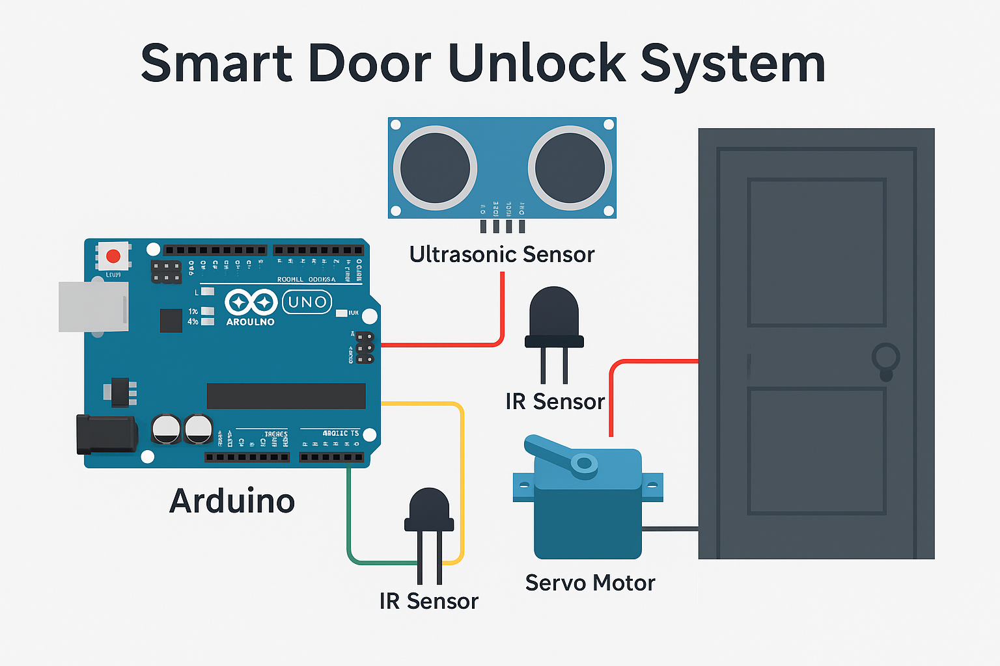

# Smart Door Unlock System

An **automatic smart door unlocking system** using **Arduino**, **ultrasonic sensor**, **IR sensor**, and **servo motor**.  
The system detects presence and proximity using sensors, then automatically unlocks the door, offering a **contactless and secure** access method.

---

## 📑 Table of Contents
1. [Features](#-features)  
2. [Technologies & Components](#-technologies--components)  
3. [Project Structure](#-project-structure)  
4. [Circuit Diagram](#-circuit-diagram)  
5. [How to Run](#-how-to-run)  
6. [Future Improvements](#-future-improvements)  
7. [Author](#-author)  

---

## 📌 Features
- **Contactless unlocking** using proximity detection.
- **Ultrasonic sensor** for distance measurement.
- **IR sensor** for motion detection.
- **Servo motor** for locking/unlocking mechanism.
- Compact and energy-efficient design.

---

## 🛠 Technologies & Components
- **Arduino Uno**
- **Ultrasonic Sensor (HC-SR04)**
- **IR Sensor**
- **Servo Motor**
- **Embedded C** for programming

---

## 📂 Project Structure
| Folder/File | Description |
|-------------|-------------|
| `code/`     | Arduino source code for controlling sensors and motor |
| `README.md` | Project documentation |
| `image.png` | Circuit diagram image |

---

## 🔌 Circuit Diagram

---

## 🛠 How to Run
1. Install the [Arduino IDE](https://www.arduino.cc/en/software).
2. Connect your Arduino Uno to your computer.
3. Upload the code from the `code/` folder to the Arduino board.
4. Connect components as per the circuit diagram.
5. Power the Arduino and test the system.

---

## 🚀 Future Improvements
- Integration with **mobile app control**.
- Adding **RFID authentication**.
- Battery backup for power outage support.

---

## 👤 Author
**Lakshmi K**  
- GitHub: [Lakshmi711](https://github.com/Lakshmi711)  
- LinkedIn: [Lakshmi711](https://www.linkedin.com/in/Lakshmi711)
